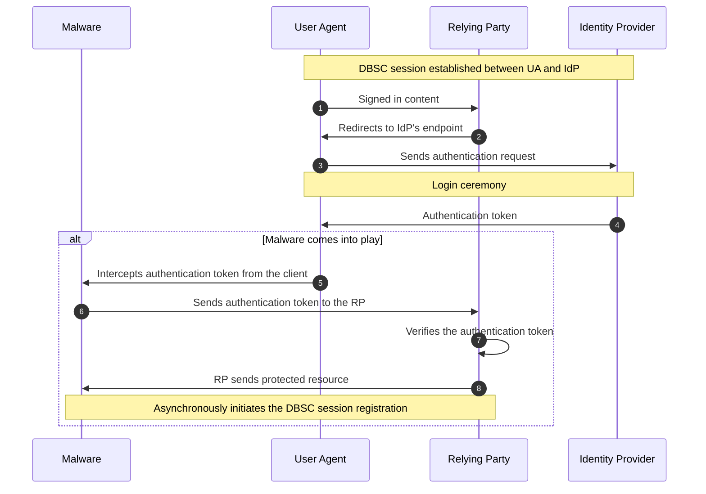
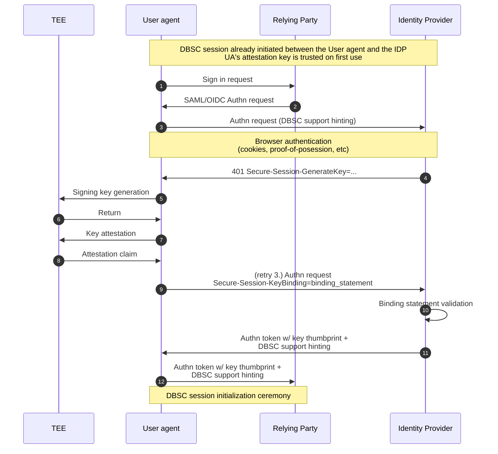
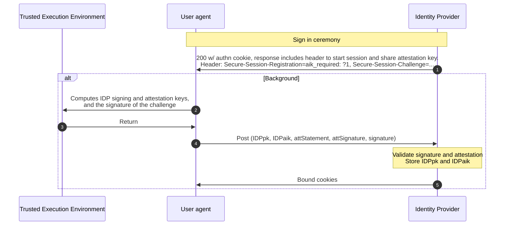
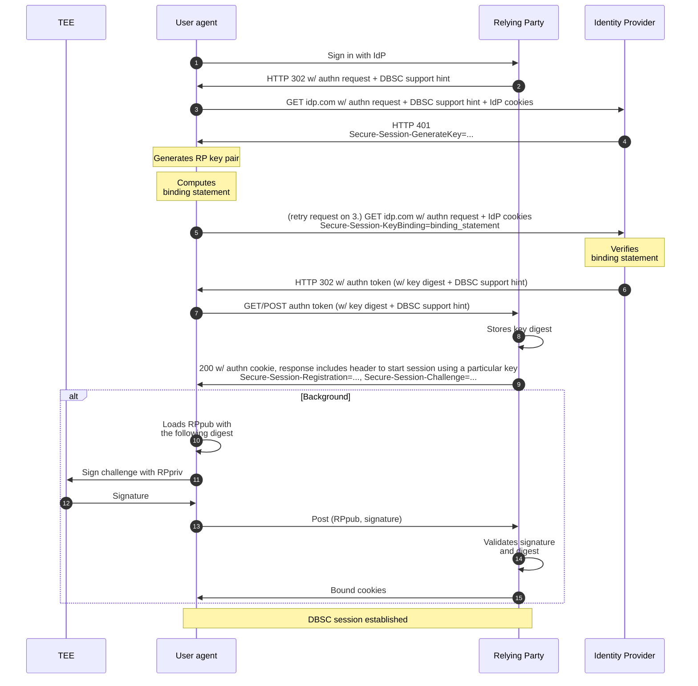

# Device Bound Session Credentials for SSO Explainer

## Authors

* [Lucas Santos](), Google
* [Daniel Margolis](), Google
* [Daniel Rubery](), Google
* [Alex Ilin](), Google
* [Rob Starling](), Google

## Contributors

* [Arnar Birgisson](), Google

## Participate

[Issue tracker](https://github.com/w3c/webappsec-dbsc/issues)

## Table of Content

<!-- START doctoc generated TOC please keep comment here to allow auto update -->
<!-- DON'T EDIT THIS SECTION, INSTEAD RE-RUN doctoc TO UPDATE -->

- [Introduction](#introduction)
- [Attack vector in depth](#attack-vector-in-depth)
- [Terminology](#terminology)
- [High-level design](#high-level-design)
  - [Identity Provider's session initialization](#identity-providers-session-initialization)
  - [Relying Party's session initialization](#relying-partys-session-initialization)
  - [Session refresh](#session-refresh)
  - [Key access control](#key-access-control)
- [Component-level design](#component-level-design)
  - [Relying Party](#relying-party)
    - [SAML Assertion and OIDC Tokens](#saml-assertion-and-oidc-tokens)
    - [Key storage](#key-storage)
    - [DBSC session registration](#dbsc-session-registration)
  - [Identity Provider](#identity-provider)
    - [DBSC registration header](#dbsc-registration-header)
    - [Registration statement validation](#registration-statement-validation)
    - [Public and attestation keys storage](#public-and-attestation-keys-storage)
    - [User consent for key sharing](#user-consent-for-key-sharing)
    - [DBSC Key generation header](#dbsc-key-generation-header)
    - [Binding statement validation](#binding-statement-validation)
    - [SAML Assertions and OIDC tokens](#saml-assertions-and-oidc-tokens)
  - [User agent](#user-agent)
    - [Identity Provider registration statement](#identity-provider-registration-statement)
  - [Delegated key generation](#delegated-key-generation)
  - [Identity Provider binding statement](#identity-provider-binding-statement)
  - [Relying Party's session initialization](#relying-partys-session-initialization-1)
- [Alternatives Considered](#alternatives-considered)
  - [Relayed refreshes](#relayed-refreshes)
  - [IdP's key sharing](#idps-key-sharing)
  - [Sync vs Async key generation](#sync-vs-async-key-generation)
- [Privacy considerations](#privacy-considerations)

<!-- END doctoc generated TOC please keep comment here to allow auto update -->

## Introduction

Cookie theft has emerged as a highly effective method for compromising user accounts, surpassing credential theft (passwords) in efficacy due to intensified efforts to strengthen password-based security (e.g., 2SV and passkeys).

As the existing DBSC protocol lacks support for cross-origin SSO authentication, it creates a significant attack surface. This vulnerability arises if either the IdP or the RP fail to perform periodic proof-of-possession for securely stored cryptographic keys.

Furthermore, even if both adopt DBSC, they cannot definitively prove that the two DBSC sessions are bound to the same physical device, which opens another vulnerability: malware with temporary device access can compel the IdP to grant a sign-in to the RP, subsequently binding the RP session to an attacker-owned private key.

Additionally, if malware is present during user's sign-in to the IdP, it can bind that session to its own key material, leading to a "session init attack" where the attacker takes over the session. While **DBSC for SSO does not directly mitigate this specific vulnerability**, it empowers the IdP to integrate complementary technologies, such as mTLS, to enhance protection.

In “normal” two-party DBSC we say that malware at sign-in time is out of scope. This is reasonable because sign-in on that model is inherently infrequent and noisy for the user. That limits the scalability of malware that has to wait for the sign in ceremony to make sense to the user.

On the other hand, traditional cookie-based authentication of an established session is very frequent (every request) and totally silent. So that is ripe for scaled infostealer malware.

The reason this proposal is valuable and needed is that SSO authentication is somewhere in the middle: It’s relatively frequent (e.g. daily) and mostly invisible to the user apart from maybe some quick redirects. Generally no user action is needed.

This document is inspired by the current [DBSC(E) Explainer](https://github.com/w3c/webappsec-dbsc/blob/main/DBSCE/Overview.md) and targets consumer users, as Enterprise scenarios are already covered.

## Terminology

*  **IdP:** The **Identity Provider** that the user authenticates with. It manages user’s credentials and issues SAML assertions to relying parties.
*  **RP:** Acronym for **Relying Party**; a web application that relies on IdP's assertion to allow users to access restricted content (referred to as "SP" or "Service Provider" in SAML docs).
*  **TEE:** Acronym for **Trusted Execution Environment**; a secure, isolated area within a computer's main processor (CPU) that protects sensitive data and code from other parts of the system.
*  **AIK:** Acronym for **Attestation Identity Key.**
*  **Key material:** Asymmetric key pair hardware-backed (either by TPMs on PCs or Secure Enclaves on Mac devices).

## How is it different from DBSC(E)?

While both proposals aim to protect the IdP <> RP dance, they target different use cases and threat models:

*   **DBSC for SSO** targets **consumer scenarios** where devices are unmanaged. It focuses on securing the hand-off between an Identity Provider (IdP) and a Relying Party (RP). It prevents attackers from using stolen IdP authentication tokens to establish sessions on their own devices by ensuring the RP session key is bound to the same device as the IdP session. It relies on the IdP's existing session trust (often Trust On First Use).

*   **DBSC(E)** targets **enterprise scenarios** with managed devices. It relies on a **"clean room" device registration** process where the device is pre-provisioned and trusted by the organization. It introduces specific components like a "Local Key Helper" to enforce that binding keys are generated on these trusted devices, mitigating malware that might be present during the sign-in ceremony.

## Attack vector in depth

Relying parties (RP) that adopt DBSC protect their users against cookie theft as they periodically ask for proof-of-possession in order to issue fresh authentication cookies. However, those who adopt Single Sign On (SSO) are still vulnerable to this kind of attack, even if both the RP and the Identity Provider (IdP) adopt DBSC. The vulnerability is particularly subtle when both RP and IDP implement DBSC because malware can **silently** circumvent the security measures.

In this attack, the malicious software intercepts an authentication token from the IdP and uses it to establish a new RP session.

Consequently, the session becomes tied to distinct keys, controlled by the attacker. Neither the RP nor the IdP can detect this malicious activity, as both sessions appear legitimate and are successfully bound.

This attack vector does not require any user interaction, hence can be automated in the background, and built into popular infostealers. It also does not require the infostealer to keep persistent presence on the infected user device, but
only at the time of issuing new RP authentication cookies.

The following diagram shows when the malware comes into action:


Malicious software intercepts IdP's authentication token and issues a new RP session bound to its own keys, bypassing IdP's binding

## High-level design

The DBSC support for SSO authentication cryptographically links both IdP and RP keys, so that even if malware is able to trick the IdP to give the attacker an authentication token, this token becomes unusable if exfiltrated from the device that originally created the session.

This is because the device will need to, at RP-session refresh time, prove possession of a signing key that is trusted by the IdP, which in case of an IdP's cookie exfiltration will not be possible.

The device creates a new signing key for every RP the user is signing in to, and the underlying IdP is responsible for making sure the key was generated in the same device that originally signed in to the IdP.

Key attestation gives remote parties the ability to attest that a particular object is loaded in the same TEE, hence proving that both `IdPKey` and `RPKey` come from the same device.

The following diagram shows the overall SSO authentication flow and how the key presented by the User Agent is attested to be owned by the expected device:


Overview of the Single Sign-On authentication flow.

As stated in the diagram's first note, it's expected that a DBSC session between the device and the IdP is previously established. In the IdP's session initialization the user agent also sends an attestation key to the Identity Provider.

It is also expected that the IdP adopts a [TOFU](https://en.wikipedia.org/wiki/Trust_on_first_use) approach and trusts the attestation key as soon as it is presented at sign in time. Although this might represent an attack vector, IdPs can also improve their session initialization mechanism (e.g. by adopting security keys) so that they can make sure the attestation key comes from a trusted device. Such additional mechanisms are out of scope of this proposal.

The above high level diagram is broken down as follows:

**Attestation key generation:** During the session initialization between the device and the IdP, the device creates an AIK (Attestation Identity Key) and sends it to the IdP, which stores it for future RP signing keys attestation verification.

Mac devices do not support such an attestation capability, so an extra key pair is generated by the browser and provided to the Identity Provider (IdP) during sign-in to serve as such. This offers minimal security benefit currently as malicious software could inject its own RP key to be signed by the Secure Enclave. However, this implementation is designed for future compatibility: it can be directly replaced with a genuine Attestation Identity Key (AIK) once Apple introduces support for such a capability.

In addition to that, this model relies on Apple's code signing capabilities, which prevents software other than the one that created a particular Secure Enclave-protected key to access (and hence use) it.

**Sign in request:** The user navigates to an authentication-protected resource in the RP. If the user has visited that page before, generally the RP automatically redirects the user to the Identity Provider (seamless authentication), otherwise the user clicks on “Sign in With …” (interactive authentication), which generates an authentication request that is forwarded to the IdP, typically via an HTTP redirect.

**Browser authentication:** The IdP checks the browser authentication. This can be done either via authentication cookie presence or re-validating the proof-of-possession.

**Identity Provider asks the browser to generate a new key:** If the IdP detects a bound session for that browser when receiving the authentication request, it then returns an **HTTP 401** with the `Secure-Session-GenerateKey` header. The header indicates that the browser must generate a new signing key for the underlying RP.

When the browser sees the `Secure-Session-GenerateKey` header, it must check if the issuing request can set a cookie bound to the IdP's session, otherwise it fails the operation.

The new signing key must be tied to the Relying Party's domain by the browser. This serves as a protection mechanism against malicious RPs trying to *guess* unique hardware-backed identifiers. The user agent only shares the public key material with the RP that are supposed to have access to it.

The key access control model is discussed in detail [further](#key-access-control) in this document.

**Signing key generation:** This step relies on hardware-based keys generation, which can be either on TPMs (Windows and Linux), Secure Enclave (macOS), or even security keys. These keys are the same used in the standard DBSC implementation.

**Browser sends the key digest to the IdP:** When the browser finishes computing the binding statement, it retries the request that triggered the key generation, appending the new header `Secure-Session-KeyBinding` carrying the statement.

This permits the SSO authentication process to continue normally.

**Authentication tokens:** Upon a valid binding statement presented, the IdP issues its regular authentication token (SAML assertion or OIDC Tokens) to the RP, which now includes the signing key digest that should be trusted by the RP. If the authentication token is legit (signed by the IdP), the RP can trust the public key that matches the specified digest.

On OIDC flows, the key digest is included in the OIDC token, which is sent via backchannel communication between the RP and the IdP.

**RP session initialization:** RPs can issue authentication cookies bound to the key trusted by the IdP immediately, and then return the `Secure-Session-Registration` header to start the binding process on the User Agent side. The header must include the `provider_key` parameter to indicate the expected key and also the `provider_url` to indicate the IdP that attested the underlying key.

RPs should not issue unbound long-lived cookies, otherwise the session would not be protected.

**Relying Party and Identity Provider DBSC support hinting:** The Relying Party should hint the Identity Provider whether it supports DBSC. This is to avoid the browser being unnecessarily asked to generate a key and an attestation statement, as the RP will very likely ignore this information if it has no support.

As authentication requests can be spoofed, malware can fake support absence to induce the Identity Provider not to send a trusted key digest back to the RP, which would lead the RP not to start a bound session.

To circumvent this, the IdP should also hint the RP back in its **signed** response (in the SAML Assertion or OIDC Token), so that if the RP supports DBSC and does not get a trusted key digest in the assertion, it's a strong signal that the authentication request has been tampered with.

### Identity Provider's session initialization

Initializing the session with an Identity Provider has some extra steps in comparison to the standard DBSC. The attestation key is additional information required to later attest that new RP signing keys reside in the same device that the IdP has a bound session.

During the IdP's DBSC session registration the new boolean parameter `aik_required` in the `Secure-Session-Registration` header indicates that the client should provide an Attestation Key in addition to the regular signing key.

The following diagram shows how a bound session is established between the User Agent and the IdP:


Identity Provider session binding flow.

Each step in the diagram is detailed below:

**Sign in ceremony:** The sign in ceremony happens in the same way as it usually does. However, upon successful login, the IdP includes the `aik_required` parameter in the registration header (`Secure-Session-Registration`). The client **must** provide cryptographic proof of attestation and signing keys relationship.

**Key generation and attestation:** This step involves a few cryptographic operations in the TEE, which are detailed as such:

1. A new signing key pair $(IdP_{sk-pub}, IdP_{sk-priv})$ is created. $IdP_{sk-pub}$ is used to register the IdP DBSC session.

1. The challenge sent by the server is signed with $IdP_{sk-priv}$.

1. A new attestation key pair $(IdP_{ak-pub}, IdP_{ak-priv})$ is created and used to create an attestation claim for $IdP_{sk}$.

**Registration statement:** A new variant of the DBSC proof takes place to accommodate both subject and attestation keys. It uses [nested JWT](https://www.rfc-editor.org/rfc/rfc7519#appendix-A.2) so the subject key is the payload of the encompassing attestation key, expressed in the [JWS](https://www.rfc-editor.org/rfc/rfc7515) format:

```json
// Header
{
	"alg": "ES256",
	"typ": "dbsc+aik",
	"cty": "jwt", // Indicates nested JWT
	"jwk": { // Holds the attestation public key material.
		"kt": "EC",
		"crv": "P-256",
		"x": "...",
		"y": "..."
	}
}

// Payload
{
	"aud": "https://idp.com/reg",
	"jti": "Base64 encoded JWT representing the DBSC proof as specified at <https://www.w3.org/TR/dbsc/#format-jwt>",
	"att": "Base64 encoded JSON object defined below."
}
```

The attestation statement format is defined as follows:

```json
{
	"fmt": "TPM|SECURE_ENCLAVE",
	"stmt": "Base64 encoded attestation statement",
	"sig": "Base64 encoded signature of the attestation statement",
}

```

*  **fmt**: The format of the presented attestation statement. It must be either `TPM` or `SECURE_ENCLAVE`.
*  **stmt**: The attestation statement payload encoded in Base64. If `fmt` is set to `TPM`, the format of the statement is the [TPM2B\_ATTEST](https://trustedcomputinggroup.org/wp-content/uploads/TPM-Rev-2.0-Part-2-Structures-01.38.pdf#page=127) object. If `fmt` is set to `SECURE_ENCLAVE`, then it is defined as follows:

```
// pseudo-code
c := "dm9pY2VvYmplY3...bmFja3RvdWNoaGVscGY=" // challenge used in the DBSC session registration
d := hash(signing_key_public_material, "sha_256")
stmt = concat(c, d)
```

*  **sig**: The signature of `stmt` encoded in Base64. It must be signed using $IdP_{ak-priv}$.

**Server-side validation:** The server validates the registration statement and securely stores both the signing and attestation keys $(IdP_{pk}, IdP_{pak})$ public material. If valid, the server issues fresh (and bound) authentication cookies.

**Attestation key bypass:** Key attestation is used to generate per-RP keys and avoid re-using the same signing key as the IdP. This is mostly designed to prevent user tracking. However, under enterprise contexts, sharing the IdP key with multiple RPs might not pose a privacy concern, and should be allowed under certain circumstances (e.g. Enterprise browser policies) to increase adoption.

### Relying Party's session initialization

When starting an SSO flow, the RP should signal its DBSC support to the IdP. This prevents the IdP from unnecessarily requesting key generation if the RP doesn't support DBSC.

Since authentication requests can be tampered with (e.g., to hide DBSC support in a downgrade attack attempt), the RP should verify that the IdP's signed response confirms both its own DBSC support and the parameters received in the initial request. This allows the RP to detect if the request was modified to prevent a bound session from being established.

Upon authentication request, the IdP instructs the User Agent to create a new key pair through an HTTP header (`Secure-Session-GenerateKey`). Once the new signing key is generated, the browser builds the binding statement and sends it to the IdP. Upon the binding statement and session validation, the IdP sends an authentication code back to the RP containing the signing key's digest that should be trusted.

The binding statement is defined as follows:

```json
{
	"stmt": "Base64 encoded claim",
	"aik": "[Base64 encoded JWK of IdP_pak]",
	"fmt": "[TPM|SECURE_ENCLAVE]",
	"challenge": "[Base64 encoded challenge]",
	"sub_key_digest": "SHA 256 digest of RP public key"
}
```

The attestation statement `stmt` can have two different formats depending on what is specified in the `fmt` field.

*  **TPM**: The [TPM2B\_ATTEST](https://trustedcomputinggroup.org/wp-content/uploads/TPM-Rev-2.0-Part-2-Structures-01.38.pdf#page=127) structure defined in the TPM 2.0 specs.

*  **SECURE\_ENCLAVE**: The attestation statement is the concatenation of the challenge sent by the server and the signing key digest signed by $IdP_{ak-priv}$.

In other words, it can be represented by:

```
// pseudo-code
c := "aHVzYmFuZHJpZG...cmxkYmFzZWJhbGxhcnI=" // replay-resistant challenge
t := hash(signing_key_pem, "sha_256")
stmt := sign(concat(c, t), IdP_sak)
```

The following diagram shows how a new DBSC session is established between the device and the RP on top of a trusted key digest:


DBSC session initialization with a trusted key digest

Before establishing the session, the RP should evaluate the following scenarios:

* If the Relying Party **does not** support DBSC, then it proceeds as is.
* If the Relying Party **does** support DBSC, then it should evaluate:
	* If the signed IdP response contains the **same parameters initially sent by the RP and a trusted key digest**, then it should proceed with session establishment.
	* If the signed IdP response contains the **initial parameters but lacks a trusted key**, it means that the IdP failed to assert any signing key. Detailed error messages may or may not be in the IdP response.
	* If the signed IdP response **does not contain the initial parameters**, it's a strong indicator that the authentication request has been tampered with and this can be part of a downgrade attack.

The Relying Party indicates what key should be used in the parameter `provider_key` set in the `Secure-Session-Registration` header as well as the `provider_url`, which must be the IdP domain, as shown in the [DBSC federated binding draft](https://www.w3.org/TR/dbsc/#federated-sessions-example).

The value for this parameter is the key digest sent by the IdP. The browser will send the public key material only if all the following criterias match:

* RP's domain is the same indicated by the Identity Provider in the `target_domain` property of the `Secure-Session-GenerateKey` header.
* The `provider_key` parameter matches the underlying key digest.
* The `provider_url` matches the Identity Provider's domain.

Once the existing key is sent to the RP, the session registration flow happens in the same way as the standard DBSC.

### Session refresh

Both IdP and RP sessions are standard DBSC sessions, and upon authentication cookie expiration, the User Agent uses their respective signing key to perform the proof-of-possession required in the refresh process. No additional steps are required.

### Key access control

When the Identity Provider instructs the User Agent to generate a new signing key via the `Secure-Session-GenerateKey` header, the User Agent stores the generated private key and associates it with the following metadata:

*  **Target Domain:** The domain specified in the `target_domain` parameter, which is the RP domain.

Note: If the RP wants to keep separate keys for different subdomains, it's up to them to use separate [session IDs](https://www.w3.org/TR/dbsc/#device-bound-session-session-identifier) so that browsers do not overwrite keys.

*  **Provider URL:** The domain of the Identity Provider that triggered the key generation.

This metadata enforces a strict access control policy: the User Agent **must** only prove possession of this specific key to the Relying Party if:

1. The Relying Party identifies the key by its digest (via the `provider_key` parameter in the `Secure-Session-Registration` header).

1. The Relying Party's domain matches the stored **Target Domain**.

1. The `provider_url` parameter provided by the Relying Party matches the stored **Provider URL**.

By relying on the key digest as the primary identifier, the User Agent allows multiple keys to exist for the same `(Provider URL, Target Domain)` pair. This prevents key collisions in scenarios where an Identity Provider manages multiple tenants or sessions for the same Relying Party, ensuring that the correct key is always selected based on the unique fingerprint provided by the RP.

## Component-level design

In this section we dive deep into each of the involved components and detail what capabilities they support to enable cross-origin DBSC.

### Relying Party

Besides the [standard DBSC implementation](https://developer.chrome.com/docs/web-platform/device-bound-session-credentials), the RP also needs to perform the following changes to support it on SSO flows:

#### SAML Assertion and OIDC Tokens

The Identity Provider shares the trusted public key's digest and the algorithm utilized (SHA-256|384|512) with the Relying Party via either SAML Assertion or OIDC Tokens, depending on which SSO protocol the RP is using.

In case of SAML, the trusted key's digest and `digest_alg` are returned in a `saml:Advice` tag, as in the following example:

```xml
<samlp:Response>
	<saml:Assertion>
		<saml:Advice>
			<dbsc:TrustedKey xmlns:dbsc="https://www.w3.org/NS/DBSC"
				digest="nZgxCylNy7jXvn4+j0DykE+TDK4W41LTffxei29e/G0="
				digest_alg="SHA-256"/>
		</saml:Advice>
	</saml:Assertion>
</samlp:Response>
```

The XML Schema Definition for the `<dbsc:TrustedKey>` element is defined as follows:

```xml
<?xml version="1.0" encoding="UTF-8"?>
	<xs:schema xmlns:xs="http://www.w3.org/2001/XMLSchema" targetNamespace="https://www.w3.org/NS/DBSC" xmlns:dbsc="https://www.w3.org/NS/DBSC" elementFormDefault="qualified">
		<xs:simpleType name="DigestAlgorithmType">
			<xs:restriction base="xs:string">
				<xs:enumeration value="SHA-256"/>
				<xs:enumeration value="SHA-384"/>
				<xs:enumeration value="SHA-512"/>
			</xs:restriction>
		</xs:simpleType>
	<xs:element name="TrustedKey">
		<xs:complexType>
			<xs:attribute name="digest" type="xs:base64Binary|xs:string" use="required">
			<!-- documentation omitted for brevity -->
			</xs:attribute>
			<xs:attribute name="digest_alg" type="dbsc:DigestAlgorithmType" use="required">
			<!-- documentation omitted for brevity -->
			</xs:attribute>
		</xs:complexType>
	</xs:element>
</xs:schema>
```

The same attributes are present in the OIDC Token as a custom claim, as follows:

```json
{
	"iss": "http://idp.com",
	...
	"dbsc_key_digest": "nZgxCylNy7jXvn4+j0DykE+TDK4W41LTffxei29e/G0=",
	"dbsc_key_alg": "SHA-256|384|512"
}
```

In OIDC implementations, the Discovery Document may be updated to indicate that both `dbsc_key_digest` and `dbsc_key_alg` are supported claims.

#### Key storage

As the DBSC session registration is done asynchronously, the RP needs to keep track of the trusted digest sent in the authentication token, so that when the User Agent presents its key, the RP is able to compare its digest with the trusted one.

#### DBSC session registration

In the RP's DBSC session registration, the parameter `provider_key` must be sent in the `Secure-Session-Registration` header, which tells the browser what key the RP expects. To avoid any *guessing* capabilities for malicious RPs, the User Agent only sends the key if it was assigned to the RP's domain during its creation.

Once the User Agent sends the RP's public key and the signed challenge, the RP computes the received key's digest using the algorithm indicated in the authentication token sent by the IdP, and compares it with the trusted key digest also sent by the IdP. If both match, and the signature verification is successful, the RP can establish a bound session with the underlying browser.

### Identity Provider

As shown in the first diagram of this document, it is expected that the IdP supports DBSC. So starting from this premise, the Identity Provider should implement the following:

#### DBSC registration header

When the user is signing in to the IdP, besides the standard DBSC headers, the `Secure-Session-Registration` header includes the new `aik_required` parameter.

This is a [boolean](https://datatracker.ietf.org/doc/html/rfc9651#name-booleans) parameter indicating whether the User Agent should create an attestation identity key.

#### Registration statement validation

The registration statement is the payload sent to the IdP when the user is signing in to it. It is composed of the following:

* IdP public signing key material - The $IdP_{sk-pub}$ is used to validate the challenge signature. This proves possession of the private counterpart ($IdP_{sk-priv}$) of the signing key.

* IdP attestation key - The $IdP_{ak-pub}$ is used to verify the attestation claim.

* Attestation claim - The attestation claim cryptographically proves the relationship between $IdP_{sk-priv}$ and $IdP_{ak-priv}$. In other words, it proves they are both stored in the same TEE if the platform allows it. If the platform does not have such a capability (e.g. macOS), this key just proves that both come from the same client, but they **might ** not be stored in the same secure hardware.

* Challenge signature - This signature is used to prove $IdP_{sk-priv}$ possession, as previously mentioned.

To validate the registration statement, the IdP must do the following:

1. Verify the challenge signature using $IdP_{sk-pub}$.
1. Verify the attestation signature using $IdP_{ak-pub}$.
1. Verify both $IdP_{sk-pub}$ and $IdP_{ak-pub}$ are present in the attestation statement.

#### Public and attestation keys storage

As IdPs are expected to already support DBSC, most likely they already handle public key storage. In addition to the public keys, attestation keys should also be stored in association to the user session.

#### User consent for key sharing

As stated in the high-level design section, the per-RP key is 1P data from the RP's perspective. As the IdP is a third-party, the User Agent only shares the RP's key digest with the IdP under explicit user consent via [Storage Access API](https://developer.mozilla.org/en-US/docs/Web/API/Storage_Access_API).

#### DBSC Key generation header

The `Secure-Session-GenerateKey` is a new HTTP header that instructs the User Agent how to generate a key for a given Relying Party. This header contains the following properties:

* A [string](https://datatracker.ietf.org/doc/html/rfc9651#name-strings) property called `target_domain`, which is the domain of the RP performing the sign in operation. The User Agent **must** limit this key usage to the domain indicated by this property.

* A [string](https://datatracker.ietf.org/doc/html/rfc9651#name-strings) property `challenge`, which is replay-resistant challenge used to prove the private key possession.

Example:

```
Secure-Session-GenerateKey: target_domain=relyingparty.com; challenge=...
```

#### Binding statement validation

The binding statement validation is done as follows:

* The provided challenge isn't expired nor reutilized.
* The provided attestation statement is valid when:
	* The attestation mode is `SECURE_ENCLAVE` and the recreated signature of challenge and key digest concatenation is valid, or
	* The attestation mode is `TPM`, and the TPM2B\_ATTEST object holds [a valid attestation](https://trustedcomputinggroup.org/wp-content/uploads/Trusted-Platform-Module-2.0-Library-Part-1-Version-184_pub.pdf#page=214).

#### SAML Assertions and OIDC tokens

The SAML assertion or OIDC token returned to the User Agent after a successful login must contain both the trusted key digest and the algorithm used (SHA-256, 384, or 512) in the fields indicated in this section.

### User agent

There are a few capabilities that the browser must provide in order to support DBSC in SSO authentication flows, which are described as follows.

#### Identity Provider registration statement

When signing in to an IdP, the User Agent must provide not only the session key and the challenge signature, but also an attestation key that will be later used to verify per-RP keys, along with its attestation statement and signature. The attestation key, statement, and signature are generated whenever the property `aik_required` is set in the `Secure-Session-Registration` header.

The registration statement is built as follows:

1. Browser computes a new session key $(IdP_{sk-pub}, IdP_{sk-priv})$ for the IdP.
1. Browser signs the challenge sent in the `Secure-Session-Registration` header using $IdP_{sk-priv}$.
1. Browser computes a new attestation key $(IdP_{ak-pub}, IdP_{ak-priv})$ for the IdP.
	* The attestation key should be keyed by the (IdP’s domain, session ID) pair.
1. Browser computes the `attestation_claim` of $IdP_{sk-pub}$ using the attestation key $IdP_{ak}$.
1. Browser computes the `attestation_signature` using $IdP_{ak-priv}$.

The response is then encoded in the format of a DBSC proof and sent to the server.

### Delegated key generation

The User Agent creates a new key pair when instructed by the Identity Provider via the `Secure-Session-GenerateKey` header.

The User Agent only creates such a key if and only if the user has granted 3PC (via Storage Access API) for the target domain sent in the `Secure-Session-GenerateKey` header. Otherwise the User Agent returns an empty binding statement.

As the key needs to be generated while the user is signing in to the Relying Party, this operation must be done synchronously. However, as TEE key generation is generally slow (might take up to 1s to finish), this can lead to bad user experience due to considerable latency added to the sign in flow.

To overcome this issue, browsers are expected to pre-generate keys as soon as the IdP's session is established. The User Agent triggers the key creation whenever it sees the `aik_required` parameter in the `Secure-Session-Registration` header. This is a strong signal that per-RP keys are to be asked by the IdP.

### Identity Provider binding statement

When signing in to Relying Parties, the Identity Provider needs to assert that the RP key comes from the same device as originally signed in to the IdP.

This is done as follows:

1. Browser verifies that IdP has 3PC access (meaning, cookies from IdP work in a context that is 3P to the IdP), otherwise it fails the operation.
1. Browser computes the RP session key $RP_{sk}$ when the IdP instructs it to.
1. Browser retrieves the attestation key keyed by (IdP domain, session ID).
1. Browser computes the $RP_{sk}$'s attestation claim using the IdP's attestation key.
1. Browser computes the attestation claim's signature using the IdP's attestation key.
1. Browser computes the digest of $RP_{sk-pub}$.
1. Browser signs the challenge sent by the IdP using $RP_{sk-priv}$.

The response is also encoded in the format of a [DBSC proof](https://www.w3.org/TR/dbsc/#dbsc-proof) and sent to the server.

Once this binding statement is verified, the IdP can then issue an authentication token to be redirected to the RP.

### Relying Party's session initialization

The Relying Party sends the `Secure-Session-Registration` header as it would in a standard DBSC session. However, in SSO cases, this header holds the property `provider_key`, which tells the User Agent which key the RP expects. If the key with the specified digest matches the RP's domain assigned to that key, the User Agent uses it to establish the new session. From this point, the DBSC session initialization happens as usual.

## Alternatives Considered

### Relayed refreshes

Instead of creating per-RP keys and letting each relying party handle its own cryptographic operations, we considered relaying the session refreshes to the Identity Provider. However, this would impose availability requirements for IdPs, as they would need to be online in order to keep RP's users signed in.

### IdP's key sharing

A “key sharing” approach was also extensively evaluated, so the IdP dependency could be avoided and RPs would be also able to perform the proof-of-possession on their own (as they do in the current design). The approach, however, imposes a major privacy concern: a device-identifiable key would be shared across multiple RPs, allowing them not only tracking user navigation, but also correlating users sharing the same device.

Trusted Platform Modules (TPM) support creating different keys for different RPs, and attesting that their private material is present in the same device. Yet, Apple's Secure Enclave doesn't provide such capabilities, which leads to the single-shared-key approach only.

### Sync vs Async key generation

As the standard DBSC session registration (and hence key creation) happens asynchronously, we considered not changing this for SSO support. However, the current SSO protocols (SAML and OIDC) happen synchronously through a few HTTP redirects.

Keeping the key generation asynchronous would imply new RP <-> IDP communication (polling) to check when a new key is generated and verified by the IdP.

## Privacy considerations

The DBSC specification states that the protocol's goal is [not to introduce new user tracking surfaces](https://www.w3.org/TR/dbsc/#privacy-considerations).

The SSO implementation of the protocol follows the same principle, so users have total control over when and to whom their keys can be shared with. Such keys are resettable and do not uniquely identify the users' hardware.